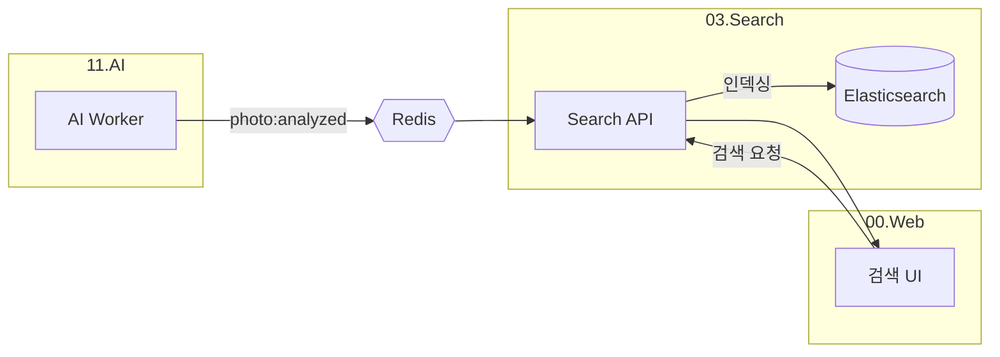

# 03. Search Service - 개발 명세서

> **검색 전용 서비스 - Elasticsearch 기반 통합 검색**

## 1. 개요

사진 및 인물 데이터를 검색하는 API를 제공합니다. 데이터 수집/분석은 11.AI가 담당하고, 03.Search는 **검색만** 담당합니다.

### 역할 분담
| 서비스 | 역할 |
|:---|:---|
| **11.AI** | 얼굴 인식, 인물 관리, 메타데이터 추출 |
| **03.Search** | Elasticsearch 인덱싱, 검색 API |

---

## 2. 기술 스택

| 구분 | 기술 |
|:---|:---|
| **Framework** | Node.js / Spring Boot |
| **Search Engine** | Elasticsearch 8.x |
| **Event Bus** | Redis Pub/Sub |

### Redis 채널

| 채널 | Publisher | Action |
|:---|:---|:---|
| `photo:analyzed` | 11.AI | ES 인덱싱 트리거 |

---

## 3. 아키텍처



---

## 4. Elasticsearch 인덱스

```json
{
  "index": "photos",
  "mappings": {
    "properties": {
      "mediaId": { "type": "keyword" },
      "ownerId": { "type": "keyword" },
      "takenAt": { "type": "date" },
      "location": { "type": "geo_point" },
      "persons": {
        "type": "nested",
        "properties": {
          "personId": { "type": "keyword" },
          "name": { "type": "text", "analyzer": "nori" }
        }
      }
    }
  }
}
```

---

## 5. API 엔드포인트

| Method | Path | 설명 |
|:---|:---|:---|
| `GET` | `/search/photos` | 사진 검색 |
| `GET` | `/search/persons` | 인물 검색 |

### 검색 예시

```http
GET /search/photos?person=이상훈&year=2022

Response:
{
  "total": 15,
  "items": [
    {
      "mediaId": "uuid",
      "url": "https://...",
      "takenAt": "2022-08-15",
      "persons": ["이상훈", "김철수"]
    }
  ]
}
```

---

## 6. 프로젝트 구조

```
03.Search/
├── docker-compose.yml
├── docs/
│   └── DEV_SPECS.md
└── search-service/
    ├── Dockerfile
    ├── package.json
    └── src/
        ├── server.ts
        ├── routes/
        ├── services/
        │   ├── elasticsearch.ts
        │   └── indexer.ts
        └── subscriber.ts    # Redis 이벤트 수신
```

---

## 7. 개발 단계

### Phase 1: 인덱싱
- [ ] Elasticsearch 연결
- [ ] Redis SUBSCRIBE (photo:analyzed)
- [ ] photos 인덱스 생성

### Phase 2: 검색 API
- [ ] `/search/photos` 구현
- [ ] 인물/날짜 필터
- [ ] 페이지네이션
